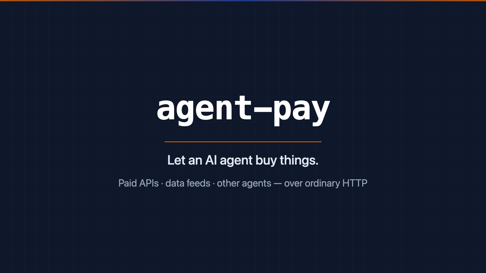

<div align="center">

# agent-pay

**Let an AI agent buy things.**

Paid APIs, data feeds, another company's agent, a seller's endpoint — over
ordinary HTTP, with spend caps you set and no private keys in your process.

[](https://github.com/armdeployment/agent-pay/actions/workflows/ci.yml)
[](LICENSE)

</div>

---

## Watch it (71 seconds)

[](docs/agent-pay-explainer.mp4)

**▶ [Play the explainer](docs/agent-pay-explainer.mp4)** — what it does, how to
fund an agent from Coinbase, how to check the balance, the limits you set, and
a real purchase settling on a test network.

## What this does

Your agent requests a URL. If it costs money, the URL says so — `402 Payment
Required`, with a price attached. `agent-pay` checks that price against limits
you set, has your vault pay it, and replays the request. A free URL comes back
untouched, so your agent's code never needs to know which URLs cost money.

That lets an agent buy things on its own: a paid API, a data feed, a document,
another company's agent. No account to open at the seller, no card on file, no
invoice, no minimum. It works for a purchase of two cents.

---

# How the money works

**If you have never used crypto, read this part.** It is the whole of what you
need to know, and there is less of it than you think.

## Your agent has an account

It is an address — a long string like
`0xD371Bb256018B09456df3Ca3b0dF38dC6C645860`. Treat it as an account number.
You can share it freely; it is how people send money in.

The balance is held in **USDC**, a dollar stablecoin. One USDC is one dollar,
and stays one dollar. You are not buying something whose price moves — this is
dollars, moved on rails that happen to be fast and cheap enough for a machine
to use for a two-cent purchase.

The account's key lives in **your vault**, never in this library. That is why
setting this up involves no seed phrase and no wallet app.

## Putting money in

**On testnet (free, use this first):** get 20 test USDC from
<https://faucet.circle.com> — pick **Base Sepolia**, paste your address. It is
play money and cannot be spent anywhere real.

**With real money:** buy USDC on an exchange you already use (Coinbase, Kraken,
Binance…) and withdraw it to your agent's address. Some let you buy USDC with a
card directly.

> ### ⚠️ The one mistake everybody makes
>
> When you withdraw, the exchange asks which **network** to send on. Your
> address exists on _every_ one of them, so a withdrawal on the wrong network
> is accepted and simply arrives somewhere else — your balance stays zero and
> nothing looks broken.
>
> **Pick `Base` (or `Base Sepolia` for testnet), and send a small amount
> first.** If a deposit does not show up, this is almost always why.

## Checking the balance

```ts
import { walletBalance } from "agent-pay";

const view = await walletBalance(agentAddress, USDC, { symbol: "USDC" });
view.formatted; // "19.98 USDC"
view.usdCents; // 1998
view.explorerUrl; // the public page listing every payment in and out
```

Or, in the example: `npm run wallet`

```
  Address    0xD371Bb256018B09456df3Ca3b0dF38dC6C645860
  Balance    19.980000 USDC   ($19.98)
```

## Seeing what it spent

Two places, and you want both.

**The public record.** Every payment is permanent and public. `view.explorerUrl`
opens a page listing every transfer in and out of your agent's account, with
amounts, timestamps and counterparties. Nobody can edit it, including you.

**Your own receipts.** Each purchase hands back a `PaymentReceipt` — amount,
seller, and the transaction id. Store them; that is your ledger, and it is the
half that knows _what was bought_, which the public record does not.

```ts
const { receipt } = await payAndFetch(url, {}, grant, { signer });
// { paid: true, usdCents: 2, payTo: "0x2096…", transaction: "0x21ff3f6d…" }

explorerTxUrl("base-sepolia", receipt.transaction);
// → https://sepolia.basescan.org/tx/0x21ff3f6d…
```

## What it costs

The seller's price, and nothing else. No monthly fee, no account, no minimum.

Your agent pays **no transaction fee**, which surprises people. It signs a
payment authorization; the seller's facilitator submits it and pays the network
fee to do so. In the worked example the agent's account holds **zero** of the
network's own currency and still completes purchases.

---

## Quick start

```bash
npm install agent-pay
```

Zero runtime dependencies. Node 20+.

```ts
import { payAndFetch, defaultSigner } from "agent-pay";

const { response, receipt, refusal } = await payAndFetch(
  "https://api.seller.example/report",
  { method: "GET" },
  grant,
  { signer: defaultSigner() },
);

if (refusal) console.error(`refused: ${refusal.reason}`); // over_per_call_cap, payee_not_allowed, …
if (receipt) console.log(`paid ${receipt.usdCents}c → ${receipt.transaction}`);
```

The wire protocol is [x402](https://x402.org) — HTTP 402 plus an `X-PAYMENT`
header — so any x402 seller, API, or agent is already a counterparty.

**A complete working example**, with a real purchase settled on a test network,
is in [`examples/procurement`](examples/procurement). It needs no account
anywhere and costs nothing:

```bash
cd examples/procurement && npm install && npm run demo
```

## The vault

`agent-pay` holds no keys. Signing is one HTTP call to a service you run:

```bash
ARM_PAY_SIGNER_URL=https://vault.internal/sign
ARM_PAY_SIGNER_TOKEN=…
```

`examples/procurement/vault.mjs` is a complete, readable one in 90 lines. In
production this is your HSM, KMS, or custody provider.

With no signer configured, `defaultSigner()` returns clearly-marked simulated
payloads in development and **refuses outright in production** — a signature
that fails at settlement surfaces as an opaque seller error hours later, which
is the worst way to find out you were misconfigured.

## The rules you set

A `PaymentGrant` is the budget decision, and the only thing this library takes
an opinion on:

```ts
const grant: PaymentGrant = {
  agentId: "agt_01",
  tenantId: "acme",
  maxPerCallUsdCents: 5_000, //  $50 a purchase
  remainingUsdCents: 20_000, // $200 left this month
  allowedPayeeHosts: ["api.seller.example"], // and nobody else
  allowedAssets: [
    {
      network: "base",
      asset: "0x833589fcd6edb6e08f4c7c32d4f71b54bda02913", // USDC
      decimals: 6,
      usdPerUnit: 1,
    },
  ],
  expiresAt: new Date(Date.now() + 15 * 60_000).toISOString(),
  humanApprovalAboveUsdCents: 1_000, // $10+ goes to a person
};
```

Mint it short-lived, from wherever your budgets actually live. `gateOffer` is a
pure function of `(offer, grant, url)`, so you can test your own policy against
it without a network.

## What stops this going wrong

| Concern                         | How it is handled                                                                       |
| ------------------------------- | --------------------------------------------------------------------------------------- |
| Keys get stolen                 | There are none here. Signing is an injected `PaymentSigner` behind your vault.          |
| An agent overspends             | Every purchase is gated: per-call cap, remaining budget, grant expiry.                  |
| An agent pays the wrong party   | Payee allowlist, matched against the URL **you** requested — not against the reply.     |
| A seller inflates its own price | Assets are valued from the grant's terms. A 402 body cannot price its own invoice.      |
| A big purchase slips through    | `humanApprovalAboveUsdCents` refuses it and hands it to your approval flow.             |
| Rounding                        | Integer maths on `BigInt` atomic units, rounded **up**. A cap is never lost to a float. |
| Nothing is configured           | Production refuses to sign rather than producing a payload that fails later.            |

The price-spoofing one is worth spelling out, because it is the attack you
would otherwise walk into: a 402 response is written by whoever you are about
to pay. If you take `decimals` from it, a seller quotes `1000` of a token it
claims has 18 decimals and drains a $5 cap. So valuation comes from the grant's
`allowedAssets` and nowhere else, and an asset the grant doesn't list cannot be
paid at all, however convincingly the response describes it.

## Rails

The network name in a 402 offer is an opaque string to this library: it is
matched against your grant's `allowedAssets` and handed to your vault. So the
rails you can use are whatever your vault can sign for and your seller's
facilitator can settle — adding one needs no change here.

The public reference facilitator settles `exact` on all of these today:

| Rail                          | x402 network id                |
| ----------------------------- | ------------------------------ |
| EVM (Base, and CAIP-2 chains) | `base-sepolia`, `eip155:84532` |
| Solana                        | `solana:…`, `solana-devnet`    |
| XRP Ledger                    | `xrpl:1`                       |
| Stellar                       | `stellar:testnet`              |
| Algorand                      | `algorand:…`                   |
| Aptos                         | `aptos:2`                      |
| Hedera                        | `hedera:testnet`               |

Query `GET <facilitator>/supported` for the live list — the one above was read
from `https://x402.org/facilitator` and will grow.

**Bitcoin is the notable absence.** It is not an x402 settlement rail, and its
block time makes per-call agent purchases impractical regardless. Paying in BTC
would need a settlement adapter behind the same `PaymentSigner` interface.

Only the `exact` scheme is gated today; `upto` and `batch-settlement` are
refused as `unsupported_scheme` rather than guessed at.

## API

| Export                 | What it does                                                       |
| ---------------------- | ------------------------------------------------------------------ |
| `payAndFetch`          | Fetch a URL, paying if it answers 402. Returns response + receipt. |
| `gateOffer`            | Pure allow/refuse for one offer against a grant. The money rule.   |
| `selectOffer`          | First offer in a 402 body the grant permits.                       |
| `parsePaymentRequired` | Parse a 402 body; `null` on anything malformed.                    |
| `atomicToUsdCents`     | Price atomic units in cents, `BigInt` maths, rounded up.           |
| `vaultSigner`          | Signer backed by your vault's HTTP endpoint.                       |
| `defaultSigner`        | `vaultSigner` wired from the environment.                          |

## Development

```bash
npm install
npm test
npm run typecheck
```

## Where this came from

Built for [ARM](https://github.com/armdeployment/arm), an HR-style control
plane for AI agents, as its `pay` connector strategy — but it has no ARM
dependency and is useful on its own. Inside ARM the grant is minted by the
control plane against real budgets and approvals, and the receipt flows back to
the spend ledger.

Apache-2.0.
